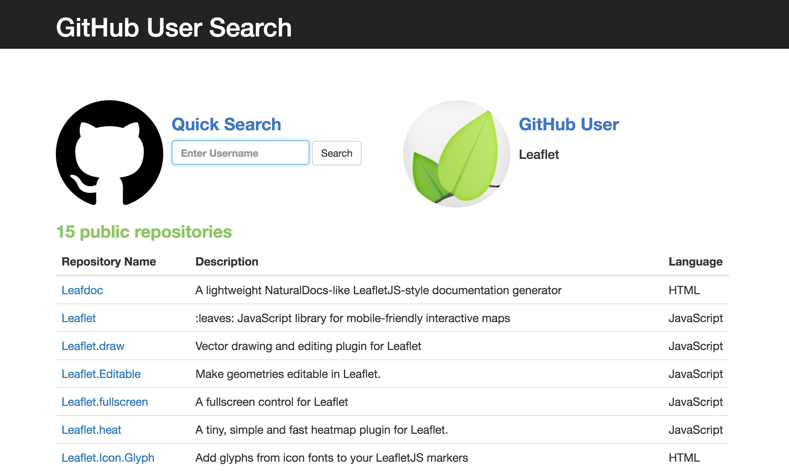

# **js-github-api**

##### A project utilizing the GitHub API. 10.14.2016
#
##### By [Lisa MacCarrigan](https://github.com/lisamaccarrigan)
#

----
### **Description**

This is a web application that allows a user to enter a GitHub username into a form, submit it, and see names and descriptions of that person's public repositories. This application utilizes the GitHub API.

----
### **Specifications**
| _Behavior_ | _Input_ | _Output_ |
|:---------------------------------------------------------------------:|:---------------------------------------------------------------------------:|:-------------------------------------------------------------------------------------------------------------------:|
| Search By Username | Enter Username: Lisa.MacCarrigan | Result: Lisa MacCarrigan |
| View User's Public Repositories | Select User | list of public repositories |
----
### **Setup/Installation Requirements**

Link to GitHub pages site: https://lisamaccarrigan.github.io/js-github-api

If editing:
* Clone this repository: https://github.com/LisaMacCarrigan/js-github-api.git
* OPEN project folder ('js-github-api') in Code Editor of choice

----

### **Known Bugs**

No known bugs.

----
### **Support and contact details**

For comments or questions, please email Lisa.MacCarrigan@gmail.com

----
### **Technologies Used**

* HTML
* JavaScript
* jQuery
* Bootstrap CDN
* GitHub API
* npm JS package manager
* Bower package manager
----
### **License**

*This application is licensed under the MIT license*

----
----
**Copyright (c) 2016 [Lisa MacCarrigan](https://github.com/lisamaccarrigan)**
